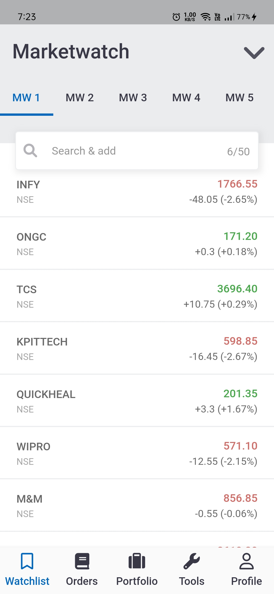
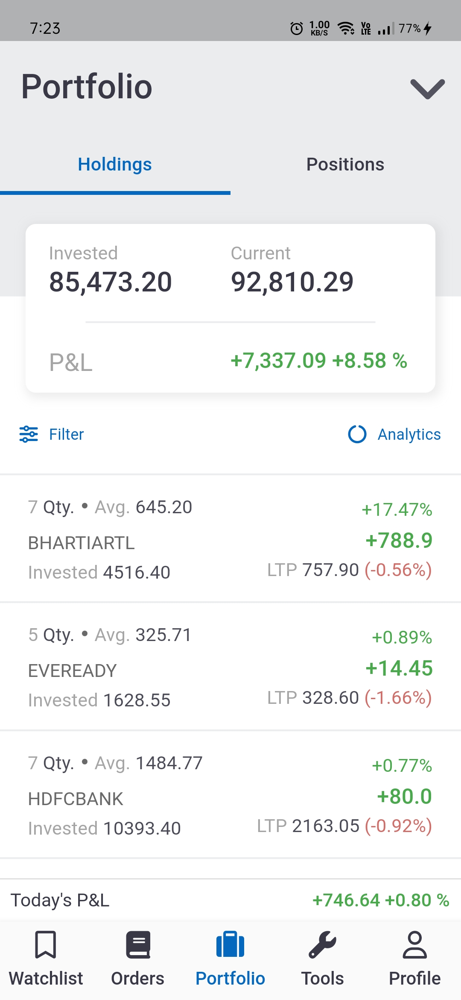
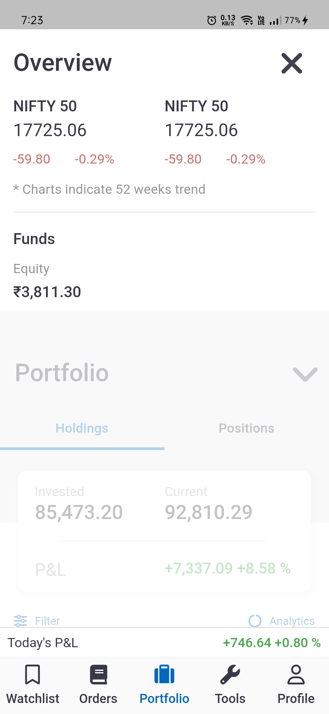
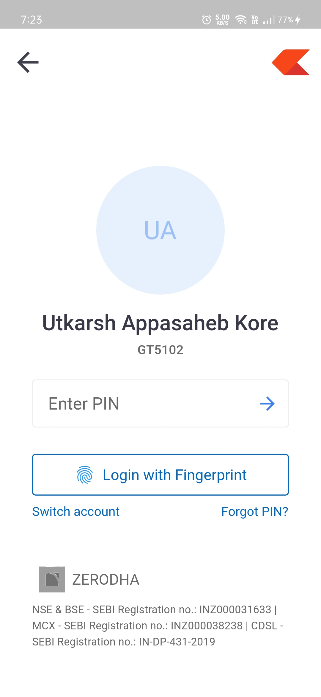
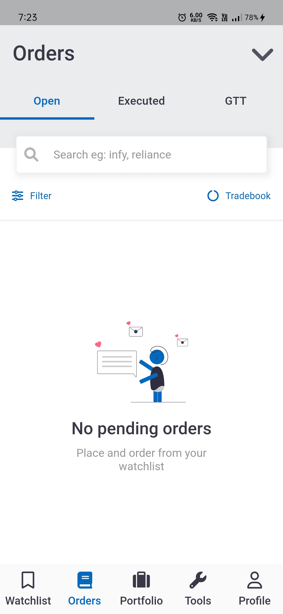
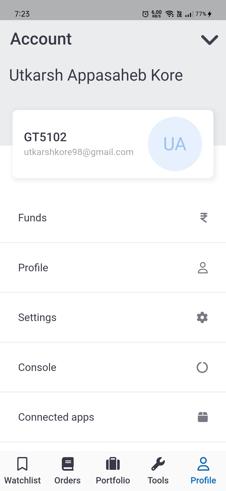

# Persuit

A purposely made close application of Zerodha's popular trading platform "Kite".

[![Watch the video]](https://drive.google.com/file/d/1ZPLLlusF5-M7C1dS9uuoZ-eHmADiDdvL/view?usp=sharing)

#### Features: 

1. Save Stocks to Watchlist
2. View Orders based on progress (Executed/Pending/GTT)
3. View Holdings and current Positions
4. View/Update Profile

#### Approach: 

The project follows **MVC architecture**. Currently, only UI part is implemented. Future commits will include backend API integration for maximum of the features. Persuit-Mobile implements **Flutter flavors** _(dev/preprod/integration/prod)_

######_Check out the repository's release for installing APK._

Persuit has web app built with React.JS. Checkout the repository [here](https://github.com/utkarsh-UK/persuit).

## Getting Started

- [Lab: Write your first Flutter app](https://flutter.dev/docs/get-started/codelab)
- [Cookbook: Useful Flutter samples](https://flutter.dev/docs/cookbook)

[online documentation](https://flutter.dev/docs)